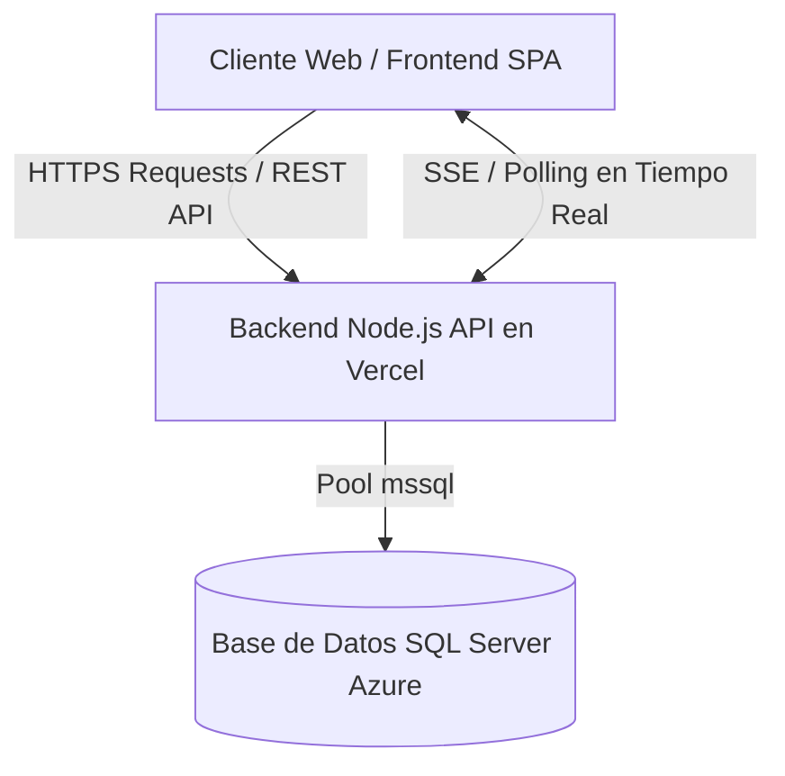

# 📋 GUÍA MAESTRA — SEGUNDO PARCIAL: DESARROLLO Y DISEÑO WEB
> **Universidad Mariano Gálvez de Guatemala (UMG)**  
> **Centro Universitario de Guastatoya — Facultad de Ingeniería**  
> **Curso:** Desarrollo y Diseño Web (036) | Ciclo VIII  
> **Catedrático:** Ing. Carlos Amílcar Tezo Palencia  
> **Estudiante:** Albino Sebastián Rosales Ruano  
> **Evaluación:** Segundo Parcial (Valoración: 15 Puntos)  
> **Repositorio Remoto Oficial:** [https://github.com/codsebas/segundo-parcial-desaweb.git](https://github.com/codsebas/segundo-parcial-desaweb.git)  
> **Plataforma de Despliegue:** [Vercel](https://vercel.com)  

---

## 🎯 1. Objetivo General del Proyecto
Desarrollar, configurar y desplegar una **Plataforma Web de Subastas de Vehículos en Tiempo Real (Estilo Copart)** con arquitectura desacoplada (Frontend + Web API RESTful + Base de Datos SQL Server), con persistencia de datos, control de roles/autenticación, inventario con filtros avanzados y motor de pujas en vivo con sincronización sin recarga de página (F5 prohibido).

---

## 🏛️ 2. Pilares de la Plataforma
1. **Regístrese:** Creación de cuenta obligatoria para interactuar (ofertar o publicar).
2. **Encuentre:** Exploración e inventario dinámico con filtros técnicos avanzados y galería de imágenes.
3. **Oferte:** Subastas interactivas en tiempo real con cronómetro regresivo y notificaciones visuales dinámicas del estado de la puja.

---

## ⚙️ 3. Requerimientos Funcionales y Reglas de Negocio

### A. Autenticación y Gestión de Usuarios
- **Modo Lectura Anónimo:** Un usuario no autenticado únicamente puede explorar el Home y el catálogo de vehículos en modo solo lectura.
- **Bloqueo de Acciones Sensibles:** Para realizar una puja o publicar/editar un vehículo, el sistema exige inicio de sesión obligatorio.
- **Registro de Usuario:** Formulario que capture:
  - Nombre
  - Apellido
  - Correo electrónico
  - Teléfono
  - Contraseña segura
- **Usuarios de Prueba Pre-creados:** El sistema debe contar con al menos 3 usuarios pre-creados con credenciales documentadas en el `README.md` para facilitar pruebas cruzadas entre múltiples navegadores.

### B. Módulo de Publicación y Gestión de Vehículos
- Cualquier usuario autenticado puede publicar vehículos para subasta.
- **Ficha Técnica Obligatoria:**
  - Año
  - Tipo de artículo / carrocería
  - Marca
  - Modelo
  - Motor
  - Transmisión
  - Tipo de combustible
  - Tren de manejo (`AWD`, `FWD`, `RWD`, `4WD`)
  - Número de cilindros
- **Clasificación por Estado de Daño (Badges de color):**
  - 🟢 **Verde:** Daño menor / Limpio.
  - 🟡 **Amarillo:** Daño medio / Reparable.
  - 🔴 **Rojo:** Daño severo / Salvamento.
- **Galería Fotográfica:** Mínimo 5 fotografías obligatorias por vehículo.
- **Parámetros de Subasta:**
  - Precio / Monto Base (mínimo Q. 20,000).
  - Fecha y Hora de Inicio.
  - Fecha y Hora de Cierre.
- **Edición de Publicaciones:** El usuario publicador puede buscar y editar sus propias publicaciones de vehículos.

### C. Home e Inventario Dinámico (Filtros Avanzados)
- **Presentación Visual:** Cards o listados creativos con diseño profesional y atractivo.
- **Paleta de Colores:** Uso de colores claros, limpios y modernos (evitar temas oscuros o apagados que dificulten la legibilidad).
- **Filtros Multitarea:** Capacidad de filtrar en vivo por:
  - Marca
  - Modelo
  - Año
  - Combustible
  - Clasificación de daño (🟢 / 🟡 / 🔴)
  - Rango de precios / monto base

### D. Detalle del Vehículo y Motor de Subastas (Tiempo Real)
- **Vista de Detalle:**
  - Despliegue completo de la ficha técnica.
  - Carrusel de imágenes interactivo con las 5+ fotos del vehículo.
  - Cronómetro de cuenta regresiva en vivo hasta el cierre de la subasta.
- **Reglas de Negocio para Pujas:**
  1. Ninguna oferta puede ser menor al monto base configurado.
  2. Ninguna oferta puede ser menor o igual a la puja más alta actual.
  3. **Incremento Mínimo:** Toda nueva puja debe superar la oferta actual por un margen de al menos **10%** (`nueva_puja >= oferta_actual * 1.10`).
  4. **Privacidad y Trazabilidad:** Los usuarios no deben ver la identidad ni nombres de otros postores; únicamente el monto de la oferta actual más alta.
  5. **Cierre de Tiempo:** Llegada la fecha/hora fin, se bloquea la recepción de ofertas y se marca como "Oferta cerrada".
  6. **Subasta Desierta:** Si llega la hora fin y no se alcanzó o superó el monto base, la subasta se declara no vendida / desierta.
- **Sincronización en Tiempo Real (CRÍTICO):**
  - La oferta actual y el temporizador deben sincronizarse instantáneamente para todos los usuarios conectados sin requerir F5 ni recarga de página.
- **Indicadores Visuales de Estado de la Puja:**
  - 🟢 **Badge Verde ("¡Vas ganando esta subasta!"):** Si el usuario autenticado tiene actualmente la oferta más alta.
  - 🔴 **Badge Rojo ("Tu oferta ha sido superada. ¡Haz tu oferta ahora antes de que termine el tiempo!"):** Si otro postor supera la oferta del usuario en tiempo real.

---

## 🏗️ 4. Arquitectura de Software y Despliegue

- **Frontend:** HTML5, CSS3 moderno, JavaScript ES Modules / SPA responsiva y fluida.
- **Backend:** Node.js Express API RESTful estructurada en controladores, rutas y servicios modulares.
- **Base de Datos:** Microsoft SQL Server alojada en Azure (`svr-sql-ctezo.southcentralus.cloudapp.azure.com`, BD: `db_WebDevUMG`).
- **Aislamiento de Tablas:** Prefijo exclusivo de estudiante (`asrr_` o `srosales_`) para evitar colisiones con otros estudiantes que comparten la base de datos comunitaria.
- **Despliegue:** Vercel mediante archivo `vercel.json` optimizado para serverless functions y static assets.

---

## 📊 5. Rúbrica de Evaluación Parcial (15 Puntos)

| Serie | Criterio | Pts | Desglose de Calificación |
| :--- | :--- | :---: | :--- |
| **SERIE I** | **Despliegue y Seguridad** | **5.0** | • **S1.1 Git y Publicación (2.5 pts):** Sitio 100% funcional en Vercel. `README.md` incluye link activo y 3 usuarios de prueba. • **S1.2 Autenticación (2.5 pts):** Login/Registro activo. Bloqueo de operaciones a anónimos (solo catálogo). |
| **SERIE II** | **Inventario y Filtros** | **5.0** | • **S2.1 Vehículo y Galería (2.5 pts):** Ficha técnica completa, color de daño (🟢🟡🔴) y carrusel de 5+ fotos. • **S2.2 Catálogo y Filtros (2.5 pts):** Catálogo Home con filtros multitarea funcionales (Marca, Modelo, Daño, etc.). |
| **SERIE III** | **Subasta y Tiempo Real** | **5.0** | • **S3.1 Tiempo Real (3.0 pts):** Pujas e indicadores ("Ganando"/"Superado") en vivo sin F5. Postores anónimos. • **S3.2 Reglas de Puja (2.0 pts):** Validación estricta en servidor: oferta > base (Q. 20,000), margen +10%, y validación de vigencia temporal. |

---

## 🛡️ 6. Contrato de Desarrollo y Buenas Prácticas
1. **Referencia Continua:** Cualquier desarrollo o funcionalidad debe validarse contra esta **Guía Maestra**.
2. **Seguridad de Credenciales:** Nunca subir credenciales sensibles (`.env`) al repositorio de Git. Usar `.env.example` y configurar variables de entorno en Vercel Dashboard.
3. **Commits Estructurados:** Realizar commits atómicos y claros que documenten el avance cronológico de cada serie de la rúbrica.
4. **Verificación Continua:** Probar localmente antes de cada despliegue a producción.
